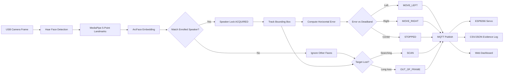

# AI-Powered Single-Speaker Face Recognition & Camera Tracking

Distributed system for BENAX Technologies: lock onto one enrolled speaker, track them in real time, and drive a servo-mounted camera via MQTT.

**Team:** 313 | **Author:** Andrew Byukusenge

---

## System overview

| Component | Role |
|-----------|------|
| **PC (Python)** | Camera → detect → recognize → speaker lock → motor commands |
| **MQTT broker** | Mosquitto relays commands (VPS or local) |
| **ESP8266** | Subscribes to MQTT, drives SG90 servo on D5 |
| **Node backend** | MQTT → WebSocket relay for dashboard |
| **Dashboard** | Live status, confidence, event log |

---

## Recognize → Track → Command pipeline



---

## Project structure

```
robotics_ne/
├── config.json              # Shared MQTT/tracking settings
├── requirements.txt         # Python dependencies (you install)
├── src/
│   ├── enroll.py            # Speaker enrollment (10–30 samples)
│   ├── vision_node.py       # Main integrated pipeline + MQTT
│   ├── face_locking.py      # Single-speaker lock logic
│   ├── operational_log.py   # CSV + JSONL evidence logs
│   ├── tracking_commands.py # Motor command generation
│   └── validate_system.py   # Pre-flight checks
├── models/                  # embedder_arcface.onnx (see README)
├── data/db/                 # face_db.npz after enrollment
├── logs/                    # Operational evidence CSV/JSONL
├── backend/                 # Node.js MQTT → WebSocket relay
├── dashboard/               # Real-time monitoring UI
└── esp8266/                 # ESP8266 firmware (Arduino / PlatformIO)
```

---

## Setup (you install dependencies)

### 1. Python environment

```powershell
py -3.12 -m venv venv312
.\venv312\Scripts\Activate.ps1
pip install -r requirements.txt -i https://pypi.tuna.tsinghua.edu.cn/simple
```

**Use Python 3.12 (`venv312`).** Python 3.13+ with mediapipe 0.10.35 breaks face_mesh (`solutions` API removed).

### 2. ArcFace model

Place `embedder_arcface.onnx` in `models/` — see [models/README.md](models/README.md).

### 3. Node.js backend

```powershell
cd backend
npm install
```

### 4. Cursor extensions (Arduino / ESP8266)

Open the Command Palette → **Extensions: Show Recommended Extensions** and install:

- **PlatformIO IDE** — build/flash/monitor ESP8266 from Cursor
- **Arduino** — alternative to Arduino IDE
- **C/C++** — IntelliSense for firmware

Firmware docs: [esp8266/README.md](esp8266/README.md)

### 5. Validate

```powershell
python -m src.validate_system
```

---

## Usage

### Step 1 — Enroll the speaker (10–30 face samples)

```powershell
python -m src.enroll
```

Controls: `SPACE` capture | `a` auto-capture | `s` save | `q` quit

### Step 2 — Start MQTT broker

```powershell
mosquitto -c mosquitto.conf
```

Or use your VPS broker (edit `config.json`).

### Step 3 — Start backend + dashboard

```powershell
cd backend
npm start
```

Open: **http://localhost:8080**

### Step 4 — Start vision node

```powershell
python -m src.vision_node --name YOUR_SPEAKER_NAME
```

Optional: `--broker 157.173.101.159 --port 1883`

### Step 5 — Flash ESP8266

Edit Wi-Fi/MQTT in `esp8266/vision_servo/vision_servo.ino` or `esp8266/src/main.cpp`, then upload via Arduino IDE or PlatformIO.

---

## MQTT topics & commands

| Topic | Payload |
|-------|---------|
| `vision/team313/movement` | `{ status, confidence, target, locked, timestamp, ... }` |
| `vision/team313/heartbeat` | `{ node, status, timestamp }` |

| `status` value | Meaning |
|----------------|---------|
| `MOVE_LEFT` / `MOVED_LEFT` | Pan camera left |
| `MOVE_RIGHT` / `MOVED_RIGHT` | Pan camera right |
| `STOPPED` / `CENTERED` | Speaker centered — hold |
| `SCAN` | Searching for enrolled speaker |
| `OUT_OF_FRAME` | Speaker lost from view |
| `NO_FACE` | No faces detected |

---

## Evidence logging

Every vision session writes to `logs/`:

| File | Contents |
|------|----------|
| `operations_<speaker>_<time>.csv` | Speaker ID, confidence, motor command, timestamp |
| `operations_<speaker>_<time>.jsonl` | Same data, JSON lines |
| `<speaker>_actions_<time>.txt` | Lock events, blinks, smiles |

---

## Configuration

Edit `config.json` for broker IP, deadband, publish rate, enrollment sample counts, etc.

---

## Assessment demo checklist

- [ ] Enrolled speaker with 10–30 samples
- [ ] Vision node locks only the enrolled speaker (others ignored)
- [ ] Servo follows speaker left/right and holds when centered
- [ ] `SCAN` sweep when speaker occluded / lost
- [ ] CSV log shows identity, confidence, commands, timestamps
- [ ] Dashboard shows live status

---

## Hardware wiring (SG90 + ESP8266)

| Servo | ESP8266 NodeMCU |
|-------|-----------------|
| Signal | D5 (GPIO14) |
| VCC | 5 V (VIN / external supply) |
| GND | GND |
