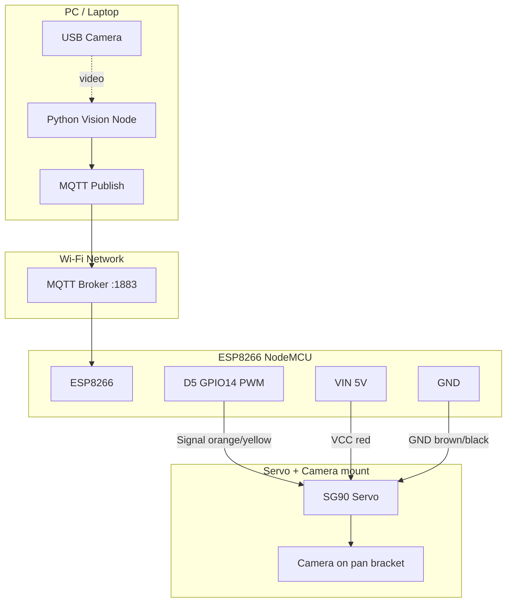

# ESP8266 + SG90 Servo Wiring (Team 313)

Use this for the MQTT camera-tracking demo. Firmware expects servo signal on **D5 (GPIO14)**.

---

## Parts

| Item | Role |
|------|------|
| ESP8266 (NodeMCU) | MQTT subscriber, PWM to servo |
| SG90 servo | Horizontal camera pan |
| USB cable | Power ESP8266 + programming |
| Male–female jumper wires | Connections |
| **5 V supply** (USB hub / VIN) | Servo motor power (do not power SG90 from 3.3 V only) |

---

## Pin map (NodeMCU labels)

| NodeMCU pin | ESP8266 GPIO | Use in this project |
|-------------|--------------|---------------------|
| **D5** | GPIO14 | Servo signal (PWM) |
| **VIN** | 5 V in | Servo VCC (when USB provides 5 V) |
| **GND** | Ground | Servo GND (common with ESP) |
| 3V3 | 3.3 V | Not used for servo |

---

## Wiring diagram



---

## Physical connections (SG90 ↔ NodeMCU)

```
   SG90 Servo                         NodeMCU ESP8266
  ┌─────────────┐                    ┌─────────────────┐
  │             │                    │                 │
  │  [Brown] GND├────────────────────┤ GND             │
  │  [Red]   VCC├────────────────────┤ VIN  (5V)       │
  │  [Orange] SIG├───────────────────┤ D5   (GPIO14)   │
  │             │                    │                 │
  └─────────────┘                    │  [USB] → PC     │
                                     └─────────────────┘
```

### Wire colors (SG90 — may vary)

| Servo wire | Connect to |
|------------|------------|
| **Brown** or **Black** | **GND** |
| **Red** | **VIN** (5 V) |
| **Orange** or **Yellow** | **D5** |

---

## Power notes (important)

1. **Common ground:** Servo GND and ESP8266 GND must be connected together.
2. **Servo current:** SG90 can draw spikes; power from **VIN/USB 5 V**, not from the 3.3 V pin.
3. **USB hub:** If provided in the kit, ESP8266 can be powered from the hub; keep grounds shared.
4. **Do not** connect servo VCC to **3V3** — weak supply and possible brownouts.

---

## System signal flow (software + hardware)

```
USB Camera → PC (enroll + vision_node) → MQTT → ESP8266 → D5 PWM → Servo → Camera pans
```

| MQTT `status` | Servo behavior |
|---------------|----------------|
| `MOVE_LEFT` / `MOVED_LEFT` | Rotate one step left |
| `MOVE_RIGHT` / `MOVED_RIGHT` | Rotate one step right |
| `STOPPED` / `CENTERED` | Hold position |
| `SCAN` / `NO_FACE` / `OUT_OF_FRAME` | Auto horizontal sweep |

---

## Pre-power checklist

- [ ] Signal → **D5** (not D4/D6 unless you change firmware)
- [ ] GND shared between ESP and servo
- [ ] Servo on **5 V** (VIN), not 3.3 V
- [ ] No short between VCC and GND
- [ ] Camera mechanically attached to servo horn / pan bracket
- [ ] Wi-Fi + MQTT configured in firmware before upload

---

## Flash / monitor (Cursor)

**PlatformIO** (recommended): open `esp8266/` folder → PlatformIO **Upload** → **Monitor** (115200 baud).

**Arduino extension**: open `esp8266/vision_servo/vision_servo.ino` → board **NodeMCU 1.0** → Upload → Serial Monitor **115200**.

---

## Troubleshooting

| Problem | Check |
|---------|--------|
| Servo jitters / resets | Separate 5 V supply; common GND; shorter wires |
| Servo does not move | D5 wiring; upload succeeded; serial shows MQTT connected |
| Wrong direction | Swap left/right in software or mount servo reversed |
| ESP not on MQTT | Wi-Fi SSID/password; broker IP in sketch matches `config.json` |
